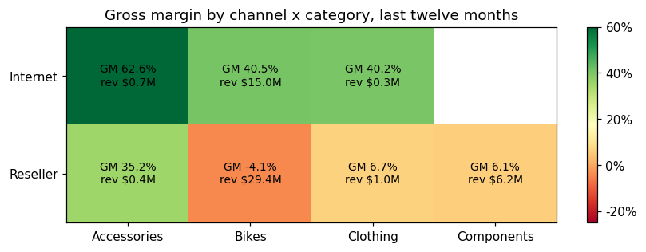
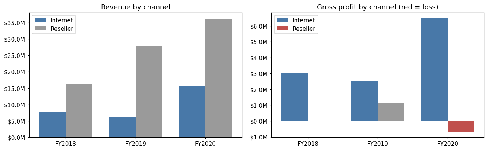
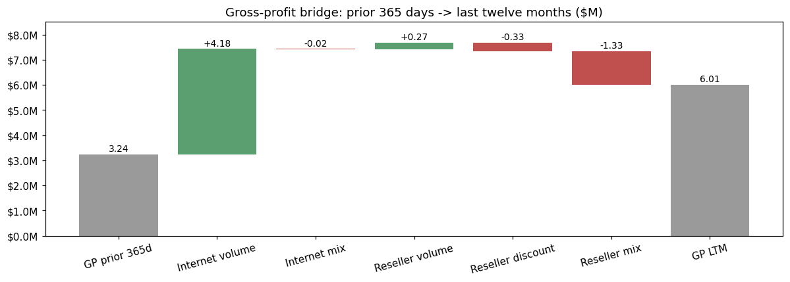
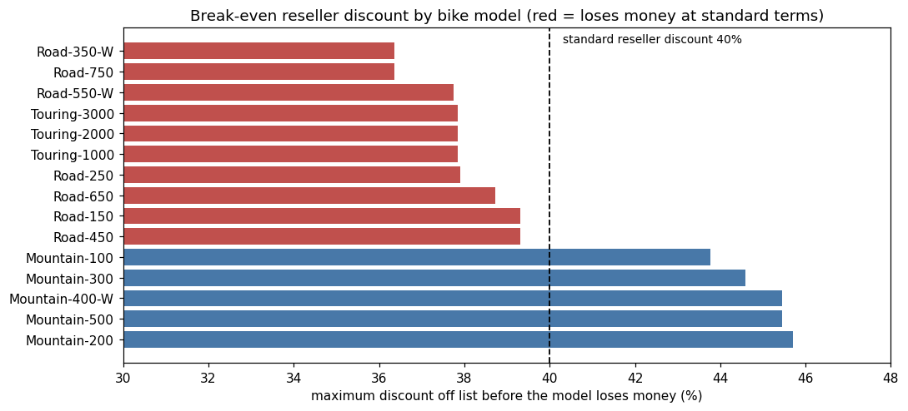
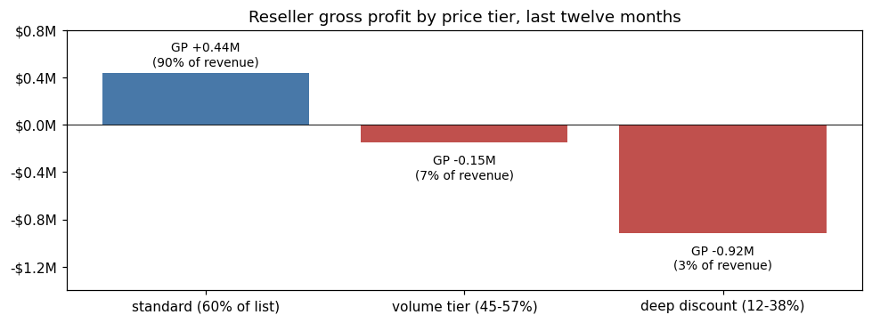
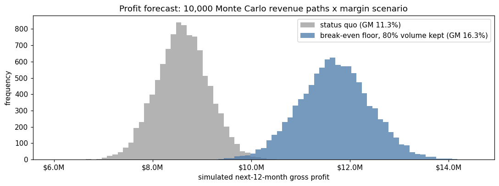

# AdventureWorks Sales Forecasting & Profitability Analysis

*[中文版](README.md)　|　Capstone project, MSc Financial Data Technology, University College Dublin*

> First replace a single-point sales forecast with a full distribution of outcomes — then ask whether that revenue is profitable, where profit is lost, and what should change.

Built on three years of AdventureWorks transaction history (121,253 order lines, $109.8M in sales), the project has two parts. **Part 1** delivers a 12-month forecast as a probability distribution, quantifies the chance of hitting management targets, and produces channel / category / region breakdowns that reconcile exactly with the company total. **Part 2** uses the cost fields in the data for a profitability analysis: it decomposes why gross profit changed, quantifies a pricing fix, and carries the revenue forecast through to a profit forecast.

---

## Context and scope

**Business situation.** AdventureWorks (retail and wholesale of bicycles and accessories) planned annually from single-point sales forecasts. Leadership wanted a risk-aware alternative — not just a forecast value, but the full range of plausible outcomes and the probability of hitting financial targets. The analyst brief was to supply that probabilistic view for resource allocation and risk management.

**Required scope.** Forecast the next 12 months using two simulation methods — Monte Carlo (top-down, simulating the annual growth rate) and bootstrap (bottom-up, resampling historical daily sales); compare their assumptions, strengths and limitations; and deliver a planning range to management.

**Work added beyond that scope** (all detailed below):

- Identified and solved a **blocking methodological problem**: too few complete years left only one growth observation, resolved by evaluating three alternative definitions and adopting a rolling fiscal year
- Three bootstrap refinements: month stratification, joint-day resampling (coherent segment forecasts), and an adapted transaction-level Poisson simulation
- Sensitivity analysis across five assumption sets, plus an independently constructed (transaction-level) cross-validation of the zero-growth result
- Data-boundary diagnostics (identified an extraction cutoff, not declining demand)
- A six-page interactive Power BI dashboard and a three-minute management pitch

**Part 2: profitability analysis** (an independent extension after the module, [detailed below](#part-2-profitability-analysis)): channel × category margin matrix, gross-profit bridge (exact volume / discount / mix decomposition), reseller break-even discount analysis, price-floor scenarios, and the extension from revenue forecast to profit forecast.

---

**Deliverables:** [Executive report (PDF)](report/Executive_Report.pdf) · [Forecasting notebook](notebooks/sales_forecasting_simulation.ipynb) · [Profitability notebook](notebooks/profitability_analysis.ipynb) · [**⬇️ Download Power BI dashboard**](https://github.com/siiucd1-cyber/adventureworks-sales-forecasting/raw/main/dashboard/powerbi_dashboard.pbix)

---

## Key results

### Revenue forecast (Part 1)

| | Forecast | 90% interval |
|---|---|---|
| **Trend continues** (Monte Carlo) | **$75.9M** | $68.2M – $83.6M |
| **Growth stalls** (stratified bootstrap) | **$53.0M** | $50.5M – $55.5M |

**The number that mattered to management:** the probability of beating last year by 10% is ~100% if the growth trend holds, but only **12%** if growth stops. That gap — not either point estimate — is the company's real planning risk.

**Recommendation delivered as a range, not a number:**

| Scenario | Value | Use |
|---|---|---|
| Main planning range | **$68M – $76M** | Budget floor → expected value |
| Downside stress | $53M | Stress-test cash flow and inventory |
| Upside capacity | $84M | Size supply chain, do not budget for it |


### Profitability (Part 2)

| Finding | Numbers |
|---|---|
| Profit is concentrated in the Internet channel | Internet: 30% of revenue at a 41% margin, earning more than total company gross profit; Reseller: 70% of revenue at a negative margin |
| Reseller growth without profit | LTM revenue +34%, gross profit +$0.76M → −$0.63M |
| Selling below cost | 61% of reseller revenue ($22.5M) is priced below standard cost |
| Recommendation: reseller price floor | +$2.2M gross profit (company GP $6.0M → $8.2M); the cost is −$2.8M revenue if 20% of affected volume leaves |
| Profit forecast | Status quo $8.6M (90%: $7.7M – $9.5M); about $11.7M with a break-even floor and 20% of affected volume lost |

→ [Full analysis: bridge, root causes, scenarios, action list](#part-2-profitability-analysis)

---

## The problem

AdventureWorks planned annually from single-point forecasts. Leadership needed to know two things a point estimate cannot answer: what is the **full range** of plausible outcomes, and what is the **probability** of hitting a given financial target?

## Approach

Two independent simulation families, plus three methodological extensions.

**1 · Monte Carlo (top-down).** Simulates the annual growth rate — the quantity that actually drives the target — over 10,000 trials, applied to the current run rate.

**2 · Bootstrap (bottom-up).** Non-parametric: builds 1,000 possible years by resampling real daily sales, assuming no distribution at all.

**3 · Extensions.** Month-stratified sampling (restores seasonality and current sales level), joint-day resampling (coherent segment forecasts), and a transaction-level Poisson simulation used as a diagnostic cross-check.

### The methodological problem I had to solve first

The brief called for year-over-year growth rates from complete calendar years. The data contains only **two** — which yields exactly **one** growth observation (+40.6%) and no way to estimate a standard deviation. I evaluated three alternative definitions before committing:

| Option | Definition | n | Mean | Std dev | Verdict |
|---|---|---|---|---|---|
| A | Monthly YoY | 23 | 80.6% | 87.1% | ✗ Monthly-scale noise; low-base months inflate the mean |
| B | Fiscal-year YoY | 2 | 47.5% | 6.7% | ~ Right quantity, but σ swings 6.7%→11.8% depending on how 15 missing days are imputed |
| C | **Rolling fiscal-year (TTM)** | **12** | **43.2%** | **8.8%** | ✓ **Selected** — annual-scale growth with enough observations |

Option C is the fiscal-year logic of B with the year-end rolled across twelve month-ends. Its limitation is stated openly in the report: overlapping windows make the observations correlated, so σ is likely understated — which is why the volatility assumption is stress-tested separately.

**Data validation caught one more trap:** the date dimension runs to June 2021, but transactions stop abruptly on 15 June 2020. Comparing the final 20 days ($210,541/day) against the prior 90 ($151,247/day) showed activity was still *rising* — an extraction cutoff, not a business collapse. Treating it as declining demand would have biased every forecast downward.

---

## Key insight: the granularity spectrum

The same data, resampled at three different grains, produces three very different risk estimates:

| Resampling grain | Model | 90% interval width |
|---|---|---|
| Year | Monte Carlo | **$15.4M** |
| Day | Stratified bootstrap | $5.0M |
| Transaction | Poisson simulation | $1.5M |


Every step down in grain adds an independence assumption — days independent of days, order lines independent of order lines — and each one shrinks the simulated interval further below the true risk. A transaction-level model looks the most sophisticated and is the most *over-confident* about annual outcomes.

**The practical rule this produced:** set targets at year grain, plan operations at day grain, analyse mix at transaction grain. Choose the grain by the question, not by how granular the data allows you to go.

---

## Coherent segment forecasts without estimating a correlation matrix

Segment-level forecasts are the obvious next ask — but simulating each segment independently is unsafe here. A diagnostic showed most segments are not statistically estimable (Accessories shows +566% "growth" purely from a low base) and the two sales channels' growth rates correlate at **−0.72**: independent simulations would misstate total risk.


The fix cost one design change: resample **day indices** rather than day values, so each drawn day carries its full segment decomposition. Within-day cross-segment structure is preserved exactly, no correlation matrix is estimated, and channel/category/region parts sum to the simulated total in **all 1,000 trials** — verified by assertion in the notebook.


Business findings that came out of it: Bikes account for **84% of revenue** (concentration risk), and Europe now contributes **25% of recent sales** against an 18% three-year average (the growth engine). Internet's interval is narrow while Reseller's is wide — steady B2C demand versus lumpy B2B batch orders, so the two channels need different planning buffers.

---

## Validation

**First, two things that must not be conflated: differences between models are the finding; agreement within one scenario is the validation.**

**The large gap between models is the core finding, not an error.** Monte Carlo ($75.9M) and the plain bootstrap ($37.1M) differ by more than 2×. Neither is miscalculated — they answer different questions: one assumes the growth trend continues, the other implicitly forecasts "next year is a random mix of the past three". That gap is the message for management.

**Agreement within one scenario is a correctness check.** The three implementations below all target the same question (zero growth) over the same pool (last 365 days):

| Implementation | Annual total | What the agreement proves |
|---|---|---|
| Stratified daily bootstrap | $53.00M | baseline |
| Joint-day bootstrap | $53.04M | **weak** — same sampling design as above (it carries day *indices* rather than day *values*), so agreement is near-automatic; it only shows the code is correct |
| Transaction-level Poisson | $53.14M | **strong** — a genuinely different construction (Poisson counts × order-line resampling) reaching the same answer by another route |

Maximum spread 0.26%. Stated honestly: **one genuinely independent cross-validation plus one code-correctness self-check** — not "three independent methods confirming each other".

- **Sensitivity analysis:** re-ran the forecast under five assumption sets (alternative growth definitions, σ × 1.5, zero-growth stress, literal-brief base). Quantified that using the stale calendar-2019 base instead of the current run rate would cut the central forecast by **$14.6M**.
- **Reproducibility:** fixed random seeds throughout; every figure and number in the report regenerates exactly on re-run.

---

## Part 2: Profitability analysis

Part 1 answered *how much will we sell*. The next questions in a business review are: **is that revenue profitable, where is profit being lost, and what should change?** The cost fields in the data (standard cost, list price) were not needed for Part 1; this part uses them to take the analysis from revenue to gross profit. Full analysis: [profitability notebook](notebooks/profitability_analysis.ipynb).

> Definitions: gross profit = sales amount − standard cost. Comparison windows match the Part 1 forecast base: last twelve months (LTM, 2019-06-17 to 2020-06-15) vs the prior 365 days.

### 1 · Where the profit is made



The two channels are two different businesses. Internet sells at list price: 30% of revenue at a 41% gross margin — **this one channel earns more than the company's total gross profit**. Reseller sells at 60% of list: 70% of revenue at a negative margin. Reseller Bikes, the largest cell ($29.4M), loses $1.2M.

### 2 · Growth without profit in the reseller channel



LTM reseller revenue grew 34%, while reseller gross profit fell from +$0.76M to −$0.63M. Company gross profit still rose only because Internet revenue nearly tripled. A plan that targets revenue growth alone would reward exactly the growth that is eroding margin.

### 3 · Gross-profit bridge: who owns the change

Writing a channel's gross profit as **GP = L × (r − c)** — L = volume valued at list price, r = realised price ÷ list (discount depth), c = standard cost ÷ list — the change between two periods splits **exactly** into three effects with different owners:

| Effect | Formula | Owner |
|---|---|---|
| Volume | (L₁ − L₀)(r₀ − c₀) | Sales — selling more at last year's economics |
| Discount depth | L₁ (r₁ − r₀) | Pricing / sales — deeper discounts |
| Product mix | −L₁ (c₁ − c₀) | Product / sales — selling higher-cost-ratio products |

Each product has a single standard cost and list price across the whole history, so c can **only** move with product mix — there is no hidden cost-inflation term. This is the same technique as a budget-versus-actual variance analysis.



- Company gross profit rose from $3.24M to $6.01M; essentially all of the gain is **Internet volume (+$4.18M)**
- 35% more reseller volume added only +$0.27M: at last year's terms, each extra dollar of list value earned under 2 cents
- The reseller loss is driven by **product mix (−$1.33M)**: the cost-to-list ratio of what resellers buy rose from 57.1% to 59.2%, while they pay 58–59% of list. **Deeper discounts** cost a further −$0.33M

### 4 · Root cause 1: one discount for every model



The deepest reseller discount a model can take without losing money is 1 − cost/list. Mountain bikes have cost-to-list ratios of 54–56% and can take 44–46% off; Road and Touring bikes sit at 60.5–63.6% and can take only 36–39.5% off (the one exception is a Road-650 version at 59.1%). **A uniform 40% discount means every Road and Touring bike sold through resellers loses money.**

The problem is growing: these loss-making versions went from 28% of reseller bike revenue in FY2018 to 59% in FY2019 and 70% in FY2020. The entire Touring line, plus Road-350-W and Road-750, entered the reseller channel during the LTM below break-even from day one (the two Mountain models launched at the same time are profitable).

### 5 · Root cause 2: discounts on top of the standard discount



Beyond the standard 60%-of-list price there are two kinds of extra discount: **volume tiers** (45–57% of list, averaging 14 units per line versus 3 at the standard price) and **deep discounts** (12–38% of list, averaging 3–4 units per line — the profile of clearance or promotions). In the LTM, the standard-priced reseller business earned only $0.44M (1.3% margin), while extra discounts on just 10% of reseller revenue lost $1.07M. The data cannot say what these discounts were for, but it shows they were granted **below cost** — so they need a floor and an approval rule.

### 6 · Action: what is a reseller price floor worth?

Proposal: **no reseller order line may be priced below standard cost ÷ (1 − target margin).** One rule covers both root causes: loss-making models get model-specific reseller prices, and extra discounts cannot go below the floor.

| Floor margin | Affected volume kept | Revenue change | GP change | Company gross margin |
|---|---|---|---|---|
| 0% (break-even) | 100% | +$2.2M | **+$2.2M** | 11.3% → 14.8% |
| 0% (break-even) | 80% | −$2.8M | **+$2.2M** | 11.3% → 16.3% |
| 0% (break-even) | 60% | −$7.7M | **+$2.2M** | 11.3% → 18.0% |
| 5% | 80% | −$2.1M | +$3.3M | 11.3% → 18.2% |

- In the LTM, **61% of reseller revenue ($22.5M) was sold below standard cost**, losing $2.2M in total. A break-even floor recovers that $2.2M, lifting company gross profit from $6.0M to $8.2M. Volume lost at a break-even price earned nothing anyway, so the gain does not depend on how much volume leaves
- **The cost is revenue**: if 20% of the affected volume leaves, revenue falls by $2.8M. A plan judged on revenue would reject this; a plan judged on profit would adopt it. Putting that trade-off on the table is the point of the analysis
- **It only holds if standard cost is mostly variable**: if 20% of standard cost were allocated fixed overhead and 40% of the affected volume left, the gain would shrink to about $0.2M; at 40% fixed overhead it would become a $1.8M loss. Confirming the cost structure with cost accounting (gross margin vs contribution margin) comes before any price change

### 7 · From revenue forecast to profit forecast



The Part 1 Monte Carlo revenue distribution (10,000 trials, same seed, reproduced exactly) multiplied by a margin scenario: at the status quo, next-twelve-month gross profit centres on **$8.6M (90% interval $7.7M – $9.5M)**; with a break-even floor and 20% of the affected volume lost, revenue is about 5% lower but gross profit centres on **$11.7M**, with the whole distribution above the status-quo upper bound. In other words, **this one pricing decision is worth more than the entire range of revenue uncertainty.**

### 8 · Findings → actions

| # | Finding | Root cause | Recommendation | Quantified impact (LTM basis) | Owner | Track with |
|---|---|---|---|---|---|---|
| 1 | Reseller revenue +34%, reseller GP +$0.76M → −$0.63M | Mix shift to Road / Touring (−$1.33M in the bridge) | Model-specific reseller prices for Road / Touring, replacing the uniform 40% discount | +$2.2M GP at a break-even floor; −$2.8M revenue if 20% of affected volume leaves | Pricing + Sales | Reseller GM by product family, monthly |
| 2 | Extra discounts: 10% of reseller revenue, −$1.07M GP | Volume tiers and deep discounts below cost | Any line below the floor needs sign-off with a stated reason (clearance / launch / strategic account) | Included in #1 | Sales ops + Finance | Share of revenue below the floor |
| 3 | New Touring line loss-making in the reseller channel from launch | Launch pricing set from list price without a channel-margin check | Add a channel-margin check to the product launch process | Avoids repeating the Touring line's $1.24M loss | Product + Finance | Channel margin of new models in their first two quarters |
| 4 | Internet: 30% of revenue, more than 100% of company GP | Sells at list price | Prioritise Internet growth for profitable families — **after** loading Internet with fulfilment and marketing costs, which gross margin excludes | Not quantifiable without opex data | Marketing + Finance | Internet contribution margin per order |

### Questions finance cannot answer alone

The data shows **where** profit is lost; whether a recommendation is right depends on facts only the business holds:

1. **Sales** — Is the 40% reseller discount contractual, a rebate structure, or a competitive response? How many resellers would leave under model-specific pricing?
2. **Product** — Was the Touring line deliberately launched below cost to win share? If so, what is the path to a positive margin?
3. **Cost accounting** — How much of standard cost is allocated fixed overhead? This decides whether "loss-making" lines really lose money at the contribution level
4. **Sales ops** — What are the 12–38% deep discounts for (clearance, promotions, key accounts), and who approves them?
5. **Channel** — Would steering Road / Touring towards the Internet channel upset resellers enough to hurt Mountain bike volume?

**Limitations:** gross profit at standard cost only — the data has no cost variances, freight, returns or operating expenses, so Internet's advantage is overstated at the gross level; price elasticity is unknown, hence retention ranges instead of one estimate; the mechanisms in the sample data are realistic, but the magnitudes are not industry benchmarks.

---

## Limitations (Part 1)

Stated plainly, because they bound how the output should be used:

1. **Thin statistical base.** The growth distribution rests on 12 *overlapping* rolling-year observations, all drawn from a single three-year expansion. The model cannot see turning points, and the normal distribution is a heuristic assumption, not an empirical finding.
2. **Bootstrap exchangeability.** Days are assumed interchangeable within their stratum — no week-to-week momentum is preserved, and the zero-growth pool freezes the segment mix of the last 12 months.
3. **Finer grain understates risk.** Transaction-level resampling breaks up multi-line B2B orders that arrive together, erasing within-day clustering; its $1.5M interval is not a credible annual risk range.
4. **Data boundaries.** Three years of history, truncated by extraction. Most segments are too small or too low-base for reliable growth estimates.
5. **No external drivers.** Entirely endogenous — macroeconomic conditions, competition and pricing strategy are outside the model.

**Next step:** re-run quarterly. Each new quarter adds rolling-year observations and tightens the growth distribution; once enough history accumulates, a segment-level Monte Carlo with correlated draws becomes viable.

---

## Dashboard

A six-page Power BI dashboard accompanies the analysis, built for the management pitch:

| Page | Content |
|---|---|
| 01 History | Monthly sales history, stacked by Internet / Reseller channel |
| 02 Risk Range | Monte Carlo histogram + three KPI cards (budget floor / expected / upside), with the 5% tails colour-coded |
| 03 Model Comparison | Annual-total distributions of all four models, overlaid |
| 04 Operations | 365-day forecast band (P5 / median / P95) + median sales by fiscal quarter |
| 05 Segment | Segment forecast bars with a dimension slicer (channel / category / territory) |
| 06 Recommendation | Four-scenario KPI cards and the final recommendation |

### ⬇️ [Download the dashboard file (powerbi_dashboard.pbix, 390 KB)](https://github.com/siiucd1-cyber/adventureworks-sales-forecasting/raw/main/dashboard/powerbi_dashboard.pbix)

Open it in **Power BI Desktop** (free, Windows) to explore all six pages and the interactive slicers.

> Note: `.pbix` is a binary format GitHub cannot preview — opening the file in the repo browser shows a blank page, which is expected; use the download link above. The charts in `figures/` are generated by the notebook, cover the same content, and are viewable online without downloading.

---

## Repository guide

```
notebooks/   sales_forecasting_simulation.ipynb   Part 1: revenue forecast, outputs saved (renders on GitHub)
             profitability_analysis.ipynb         Part 2: profitability analysis, outputs saved
report/      Executive_Report.pdf                 14-page executive report, 9 figures + 8 tables
dashboard/   powerbi_dashboard.pbix               6-page interactive dashboard
             pitch_data_for_powerbi.xlsx          simulation output prepared for BI charting
figures/     *.png                                all charts, exported from the notebook
data/        AdventureWorks_Sales.xlsx            Microsoft sample dataset (star schema)
```

### Reproduce

```bash
pip install -r requirements.txt
jupyter notebook notebooks/sales_forecasting_simulation.ipynb   # Kernel → Restart & Run All
jupyter notebook notebooks/profitability_analysis.ipynb
```

Each notebook runs end to end in under a minute. Seeds are fixed, so output matches the report exactly.

**Tech stack:** Python (pandas, NumPy, Matplotlib) · Jupyter · gross-profit bridge / variance analysis · cost-volume-profit and break-even analysis · Power BI (DAX measures, conditional formatting, binning) · dimensional modelling / star schema

---

## Notes

Data is the Microsoft AdventureWorks sample dataset, used for demonstration; figures are illustrative and not real-world sector benchmarks. Produced as an academic project for the Financial Data Technology module, UCD. AI tools were used to assist with code implementation and document formatting; the modelling framework, analytical decisions and conclusions are my own.
