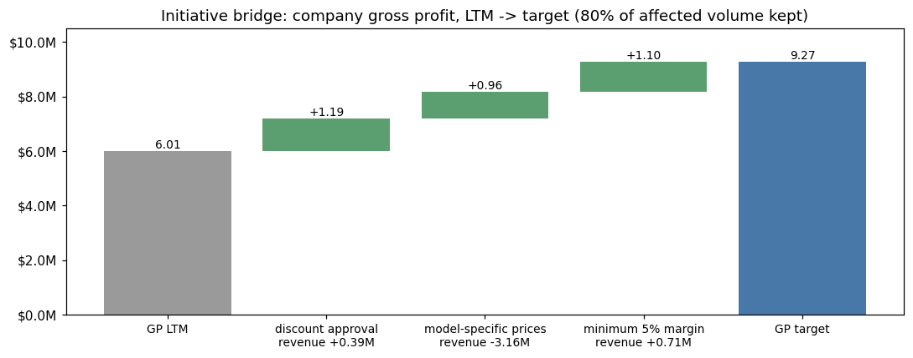

# AdventureWorks 销售预测与盈利分析

*[English version](README.en.md)　|　都柏林大学（UCD）Financial Data Technology 课程期末项目*

> 先用完整的结果分布替代单点销售预测，再追问：这些收入能不能赚钱、利润在哪里流失、该怎么改。

基于 AdventureWorks 三年交易历史（121,253 行订单明细，销售额 1.098 亿美元），项目分两部分：**第一部分**将 12 个月销售预测输出为概率分布，量化管理层目标的达成概率，并产出与总量精确一致的渠道 / 品类 / 区域分项预测；**第二部分**用数据中的成本字段做盈利分析，拆解利润变化的原因，提出可量化的定价方案，并把收入预测延伸为利润预测。

---

## 项目背景与范围

**业务场景**：AdventureWorks（自行车与配件的零售 / 批发企业）的年度规划长期依赖单点销售预测。管理层希望转向风险感知的预测方式——不仅要知道预测值是多少，更要知道全部可能结果的区间，以及达成财务目标的概率。分析师角色的任务是提供这套概率化视角，用于资源配置与风险管理。

**任务要求的范围**：用两种模拟方法预测未来 12 个月销售——蒙特卡洛（自上而下，模拟年增长率）与 Bootstrap（自下而上，重抽样历史日销售）；对比两者的假设、优劣与适用场景；最终向管理层交付可用于规划的预测区间。

**在此基础上的扩展工作**（下文均有详述）：

- 识别并解决了原方法在本数据上的**致命障碍**：完整年度不足导致增长率仅有 1 个观测值，通过三方案对比确立滚动财年口径
- 三项 Bootstrap 改进：按月分层、同日联合抽样（层级一致的分项预测）、交易级泊松模拟
- 五组假设的敏感性分析，以及用另一种构造（交易级）对零增长结果做独立交叉验证
- 数据边界诊断（识别出"提取截断"而非"业务萎缩"）
- 六页 Power BI 交互式仪表板与三分钟管理层汇报

**第二部分：盈利分析**（课程结束后的独立扩展，[详见下文](#第二部分盈利分析)）：渠道 × 品类毛利矩阵、毛利桥（销量 / 折扣 / 产品结构三因素精确拆解）、经销折扣盈亏平衡分析、价格底线方案的情景测算、措施桥（拆成三步并排出执行顺序和 KPI 目标），以及从收入预测到利润预测的延伸。

**交付物：**[📄 执行报告（PDF）](report/Executive_Report.pdf) · [📓 收入预测（Notebook）](notebooks/sales_forecasting_simulation.ipynb) · [📓 盈利分析（Notebook）](notebooks/profitability_analysis.ipynb) · [**⬇️ 下载 Power BI 仪表板**](https://github.com/siiucd1-cyber/adventureworks-sales-forecasting/raw/main/dashboard/powerbi_dashboard.pbix)

---

## 核心结果

### 收入预测（第一部分）

| | 预测值 | 90% 置信区间 |
|---|---|---|
| **趋势延续**（蒙特卡洛） | **$75.9M** | $68.2M – $83.6M |
| **增长停滞**（分层 Bootstrap） | **$53.0M** | $50.5M – $55.5M |

**真正让管理层重视的数字**：达成"超去年 10%"目标的概率，在趋势延续下约为 100%，但在增长停滞下只有 **12%**。这个落差——而不是任何一个点估计——才是企业真实的规划风险。

**以区间而非单一数字交付的建议：**

| 情景 | 数值 | 用途 |
|---|---|---|
| 主规划区间 | **$68M – $76M** | 从预算下限到趋势期望值 |
| 下行压力情形 | $53M | 现金流与库存压力测试 |
| 上行产能情形 | $84M | 供应链按此备产，但不据此做预算 |


### 盈利分析（第二部分）

| 发现 | 数字 |
|---|---|
| 利润集中在线上渠道 | 线上收入占 30%，毛利率 41%，毛利超过公司总毛利；经销收入占 70%，毛利为负 |
| 经销渠道增收不增利 | 最近 12 个月收入 +34%，毛利从 +$0.76M 降到 −$0.63M |
| 低于成本销售 | 经销收入的 61%（$22.5M）低于标准成本 |
| 建议：三步定价措施 | 毛利 $6.0M → $9.3M，毛利率 11.3% → 18.2%（假设受影响销量流失 20%，收入约少 4%）；第一步"额外折扣设底价审批"就贡献 +$1.2M，且不减少收入 |
| 利润预测 | 维持现状 $8.6M（90% 区间 $7.7M – $9.5M）；执行保本底线（流失 20% 受影响销量）后约 $11.7M |

→ [详细分析：毛利桥、根因、方案测算、建议清单](#第二部分盈利分析)

---

## 面对的问题

AdventureWorks 长期依赖单点预测做年度规划。管理层需要回答两个点估计无法回答的问题：未来销售的**完整可能区间**是多少？达成特定财务目标的**概率**有多大？

## 分析方法

两类相互独立的模拟方法，外加三项方法论扩展。

**1 · 蒙特卡洛（自上而下）** —— 直接模拟年增长率这一驱动目标的核心不确定量，10,000 次试验，应用于当前运行水平。

**2 · Bootstrap 重抽样（自下而上）** —— 非参数方法：对真实日销售额有放回抽样，构建 1,000 个可能的未来年，不假设任何分布。

**3 · 三项扩展** —— 按月分层抽样（恢复季节性与当前销售水平）、同日联合抽样（层级一致的分项预测）、交易级泊松模拟（作为诊断性交叉验证）。

### 首先必须解决的方法论障碍

题目要求用完整日历年的同比增长率，但数据中只有 **2 个**完整年——字面执行只能得到**唯一 1 个**增长观测值（+40.6%），无法估计标准差。我评估了三种替代口径后才确定方案：

| 方案 | 定义 | 观测数 | 均值 | 标准差 | 结论 |
|---|---|---|---|---|---|
| A | 月度同比 | 23 | 80.6% | 87.1% | ✗ 月度尺度噪音；低基数月份严重抬高均值 |
| B | 财年同比 | 2 | 47.5% | 6.7% | ~ 度量对象正确，但 σ 随 15 天缺失数据的补算方式在 6.7%→11.8% 间摆动 |
| C | **滚动财年（TTM）同比** | **12** | **43.2%** | **8.8%** | ✓ **选用** —— 年度尺度的正确度量 + 足够观测数 |

方案 C 本质是把方案 B 的财年逻辑沿十二个月末滚动展开。其局限也在报告中如实声明：滚动窗口相互重叠导致观测正相关，σ 可能被低估——因此对波动率假设做了单独的压力测试。

**数据验证还识别出另一个陷阱**：日期维度表延伸至 2021 年 6 月，但交易在 2020 年 6 月 15 日戛然而止。对比最后 20 天（日均 $210,541）与此前 90 天（日均 $151,247）可见活动仍在**上升**——这是数据提取截断，而非业务萎缩。若误判为需求下滑，所有预测都会系统性偏低。

---

## 核心发现：粒度光谱效应

同一份数据在三种粒度上重抽样，得到三个差异巨大的风险估计：

| 重抽样粒度 | 模型 | 90% 区间宽度 |
|---|---|---|
| 年 | 蒙特卡洛 | **$15.4M** |
| 日 | 分层 Bootstrap | $5.0M |
| 交易 | 泊松模拟 | $1.5M |


粒度每细化一级，就多引入一层独立性假设——日与日独立、订单行与订单行独立——每多一个假设，模拟出的区间就进一步低于真实风险。**交易级模型看起来最精密，实际上对年度结果最过度自信。**

**由此提炼出的实用原则**：定目标用年粒度，排运营节奏用日粒度，看结构下钻用交易粒度。按问题选粒度，而不是按数据允许的最细粒度。

---

## 无需估计相关系数矩阵的层级一致预测

分项预测是自然的下一步需求，但在这份数据上分段独立模拟并不安全。诊断显示大多数分段在统计上不可估（Accessories 呈现 +566% 的"增长"纯粹源于低基数），且两个销售渠道的增长率相关系数为 **−0.72**——独立模拟会错报总量风险。


修复只需一个设计改动：将抽样对象从"日数值"改为"**日索引**"，被抽中的日期携带其完整分段分解。日内的跨段结构被精确保留，无需估计任何相关系数，且渠道/品类/区域分项在**全部 1,000 次试验中**都精确加总为模拟总量——notebook 中以断言验证。


由此产出的业务洞察：Bikes 占收入 **84%**（品类集中度风险）；Europe 占最近一年销售 **25%**，高于三年平均份额 18%（增长引擎）。Internet 渠道区间窄而 Reseller 区间宽——B2C 需求平稳 vs B2B 批量订单起伏大，两个渠道需要不同的规划缓冲。

---

## 结果验证

**首先要区分两件性质完全不同的事：模型之间的差异是发现，同一情景下的吻合才是验证。**

**模型间的巨大差异 = 核心发现，不是误差。** 蒙特卡洛（$75.9M）与普通 Bootstrap（$37.1M）相差一倍以上。这不是哪个算错了，而是两者回答了不同的问题：前者假设增长趋势延续，后者隐含"明年是过去三年的随机混合"。这个鸿沟本身就是本项目要传达给管理层的核心信息。

**同一情景下的吻合 = 正确性验证。** 以下三套实现针对的是同一个问题（零增长情景）、同一个抽样池（最近 365 天）：

| 实现方式 | 年度总额 | 这个吻合能证明什么 |
|---|---|---|
| 分层日度 Bootstrap | $53.00M | 基准 |
| 同日联合抽样 | $53.04M | **较弱**——与上者是同一抽样设计（区别仅在于搬运"日索引"而非"日数值"），吻合近乎必然，只能证明代码无误 |
| 交易级泊松模拟 | $53.14M | **较强**——构造完全不同（泊松计数 × 订单行重抽样），从另一条路径得到同一结果 |

三者最大偏差 0.26%。诚实的表述是：**一次真正独立构造的交叉验证，加一次代码正确性自检**——而不是"三个独立方法互相印证"。

- **敏感性分析**：在五组假设下重跑（不同增长率口径、σ×1.5、零增长压力、字面题意基数），量化出若使用过时的 2019 日历年基数而非当前运行水平，中心预测将被低估 **$14.6M**。
- **可复现性**：全程固定随机种子，报告中每个数字与图表重跑均可精确复现。

---

## 第二部分：盈利分析

第一部分回答了"能卖多少"。经营分析接下来要问的是：**这些收入能不能赚钱、利润在哪里流失、该怎么改。** 数据中的成本字段（标准成本、标价）在第一部分没有用到，这一部分用它们把分析从收入推进到毛利。完整分析见 [盈利分析 notebook](notebooks/profitability_analysis.ipynb)。

> 口径：毛利 = 销售额 − 标准成本。对比期间与第一部分的预测基数一致：最近 12 个月（2019-06-17 至 2020-06-15）vs 此前 365 天。文中数字均由原始数据直接计算；人为设定的假设（销量流失比例、固定成本占比、5% 目标毛利）和推断（折扣类型的命名、根因中的推测）都在出现处注明。

### 1 · 利润从哪里来


两个渠道是两门不同的生意。线上按标价销售，收入占 30%，毛利率 41%，**一个渠道的毛利就超过了公司总毛利**。经销按标价的 60% 销售，收入占 70%，毛利率为负；其中经销自行车是收入最大的一格（$29.4M），亏损 $1.2M。

### 2 · 经销渠道增收不增利


最近 12 个月经销收入增长 34%，毛利却从 +$0.76M 降到 −$0.63M。公司总毛利仍在增长，完全是因为线上收入涨了近三倍。如果只按收入增长做计划，恰恰会奖励正在侵蚀利润的那部分增长。

### 3 · 毛利桥：利润变化该由谁负责

把渠道毛利写成 **毛利 = L × (r − c)**，其中 L 是按标价计的销量，r 是实收价 ÷ 标价（折扣深度），c 是标准成本 ÷ 标价。两期之间的变化可以精确拆成三块，分别对应不同的业务负责人：

| 因素 | 公式 | 对应部门 |
|---|---|---|
| 销量 | (L₁ − L₀) × (r₀ − c₀) | 销售：按去年的条件多卖了多少 |
| 折扣深度 | L₁ × (r₁ − r₀) | 定价 / 销售：折扣是否加深 |
| 产品结构 | −L₁ × (c₁ − c₀) | 产品 / 销售：是否更多卖了成本率高的产品 |

每个产品在整个历史中只有一个标准成本和一个标价，所以 c 的变化**只可能来自产品结构**，没有隐藏的成本上涨项。这和预算 vs 实际的差异分析是同一套方法。


- 公司毛利从 $3.24M 增至 $6.01M，增量基本全部来自**线上销量（+$4.18M）**
- 经销销量增长 35%，只带来 +$0.27M：按去年的条件，每 1 美元标价销量只赚不到 2 美分
- 经销亏损的主因是**产品结构（−$1.33M）**：经销商所买产品的成本 / 标价从 57.1% 升到 59.2%，而实收价只有标价的 58–59%；**折扣加深**又带来 −$0.33M

### 4 · 根因一：所有型号用同一个折扣


一个型号在经销渠道能承受的最大折扣 = 1 − 成本 / 标价。山地车（Mountain）的成本率是 54–56%，最多能打 44–46% 的折扣；公路车和旅行车（Road / Touring）的成本率是 60.5–63.6%，最多只能打 36–39.5% 的折扣（唯一例外是 Road-650 的一个版本，59.1%）。数据中 94.6% 的经销订单行，成交单价恰好是标价的 60%，相当于统一打了 40% 的折扣。**按这个价格，后两类每卖一辆都亏钱。**

问题还在扩大：这些亏损版本占经销自行车收入的比例，从 FY2018 的 28% 升到 FY2019 的 59%，再到 FY2020 的 70%。最近 12 个月新进入经销渠道的整个 Touring 系列以及 Road-350-W、Road-750，从进入经销渠道的第一天起就低于盈亏平衡点（这些车型 2019 年 5 月 31 日先在线上开售，7 月初进入经销渠道；同期进入的两款山地车是赚钱的）。

### 5 · 根因二：标准折扣之外的额外折扣


标准的 60% 价格之外还有两类额外折扣：**批量折扣**（实收价为标价的 45–57%，平均每行 14 件，标准价订单平均 3 件）和**深度折扣**（12–38%，平均每行 3–4 件，像是清仓或促销）。这两个名称是我根据订单量特征起的，数据里没有记录折扣类型的字段。最近 12 个月，按标准价销售的经销业务只赚 $0.44M（毛利率 1.3%），而只占经销收入 10% 的额外折扣亏掉了 $1.07M。数据看不出这些折扣是为了什么，但能看出它们**低于成本**，所以需要底价和审批规则。

### 6 · 行动方案：经销价格底线值多少钱

方案：**任何经销订单行的价格，不得低于 标准成本 ÷ (1 − 目标毛利率)。** 这一条同时覆盖两个根因：亏损型号得到按型号区分的经销价，额外折扣也不能突破底线。

| 底线毛利率 | 受影响销量保留 | 收入变化 | 毛利变化 | 公司毛利率 |
|---|---|---|---|---|
| 0%（保本） | 100% | +$2.2M | **+$2.2M** | 11.3% → 14.8% |
| 0%（保本） | 80% | −$2.8M | **+$2.2M** | 11.3% → 16.3% |
| 0%（保本） | 60% | −$7.7M | **+$2.2M** | 11.3% → 18.0% |
| 5% | 80% | −$2.1M | +$3.3M | 11.3% → 18.2% |

- 最近 12 个月，**经销收入的 61%（$22.5M）低于标准成本**，合计亏损 $2.2M。保本底线能收回这 $2.2M，公司毛利从 $6.0M 升到 $8.2M。因为流失的销量在保本价下本来就不赚钱，所以毛利增量不受流失比例影响
- **代价是收入**：如果 20% 的受影响销量流失，收入会减少 $2.8M。按收入考核的计划会否决这个方案，按利润考核的计划会采纳它。把这个取舍摆到桌面上，正是这项分析的意义
- **前提是标准成本大部分是变动成本**：如果标准成本里有 20% 是分摊的固定制造费用，同时 40% 的受影响销量流失，毛利增量会缩小到约 $0.2M；固定比例到 40% 时反而会亏 $1.8M。所以调价之前，要先和成本会计确认成本结构（毛利和边际贡献的区别）

#### 拆成三步：先做哪一步

一条政策拆成几项独立的措施，更容易审批、排序和落实到人。下面按顺序逐步叠加底价，每一步都在上一步的基础上计算，不重复计算（假设受影响销量流失 20%，每行订单只在第一次涨价时流失一次）：



| 措施 | 内容 | 毛利变化 | 收入变化 |
|---|---|---|---|
| 现状 | | $6.01M | |
| ① 额外折扣审批 | 批量折扣和深度折扣不得低于标准成本，例外需审批 | **+$1.19M** | +$0.39M |
| ② 按型号定经销价 | 亏损车型的标准价订单提高到保本价 | +$0.96M | −$3.16M |
| ③ 最低毛利 5% | 所有经销订单的底线从保本提高到 5% 毛利 | +$1.10M | +$0.71M |
| **目标** | | **$9.27M** | 合计 −$2.06M |

- **第一步收益最大、代价最小**：毛利 +$1.19M，收入反而略增，因为这些订单原来的价格远低于成本。它也最容易执行，只是一条审批规则，不用改价目表
- **第二步是唯一明显减少收入的一步**：毛利 +$0.96M，收入 −$3.16M。动手之前，要先和销售确认下面"需要业务部门确认的问题"中的第 1、2 条
- 三步合计：毛利 $6.01M → $9.27M，公司毛利率 11.3% → 18.2%，经销毛利率 −1.7% → 7.5%，收入约少 $2.1M（4%）
- 第一步有一个特殊情况：**清仓库存**的成本已经是沉没成本，如果不卖就只能报废，那么低于标准成本卖掉可能是对的。所以第一步是"审批"而不是"禁止"，它的收益是一个上限

### 7 · 从收入预测到利润预测


把第一部分的蒙特卡洛收入分布（10,000 次，随机种子不变，结果与第一部分完全一致）乘以毛利率情景：维持现状，未来 12 个月毛利集中在 **$8.6M（90% 区间 $7.7M – $9.5M）**；执行保本底线并流失 20% 受影响销量，收入低约 5%，毛利却集中在 **$11.7M**，整个分布都在现状的上限之上。也就是说，**这一个定价决策的影响，大于全部收入不确定性的范围。**

### 8 · 建议清单

| # | 发现 | 根因 | 建议 | 量化影响（最近 12 个月口径，受影响销量流失 20%） | 负责部门 | 跟踪指标：现状 → 目标 |
|---|---|---|---|---|---|---|
| 1 | 额外折扣占经销收入 10%，亏损 $1.07M | 批量折扣和深度折扣低于成本 | **第一步做。** 以标准成本为底价，低于底价的订单需审批，并注明原因（清仓 / 新品 / 战略客户） | 毛利 +$1.19M，收入 +$0.39M | 销售运营 + 财务 | 额外折扣订单的毛利：−$1.07M → +$0.29M |
| 2 | 经销收入 +34%，毛利 +$0.76M → −$0.63M | 产品结构转向 Road / Touring（毛利桥 −$1.33M） | 对 Road / Touring 按型号设定保本的经销价，取代统一的 40% 折扣；之后把所有经销订单的底线提高到 5% 毛利 | 保本阶段毛利 +$0.96M、收入 −$3.16M；提到 5% 后毛利再增加 $1.10M | 定价 + 销售 | 经销毛利率：−1.7% → 7.5%；Road / Touring 经销毛利率：−9.3% → 5.0% |
| 3 | 新 Touring 系列一进入经销渠道就亏损 | 推测：定价时没有按渠道检查毛利（数据无法证实，需与产品部门确认） | 新品上市流程加入渠道毛利检查，每个渠道都要达到最低毛利 | 避免重复 Touring 系列 $1.24M 的亏损 | 产品 + 财务 | 新品前两个季度的渠道毛利率 ≥ 5% |
| 4 | 线上收入占 30%，毛利超过公司总毛利 | 按标价销售 | 优先发展盈利产品的线上销售，但要**先**把履约和营销成本算进线上（毛利不含这些） | 缺少费用数据，无法量化 | 市场 + 财务 | 线上单笔订单的边际贡献（待建立） |

公司层面，执行三步之后（现状 → 目标）：毛利 $6.01M → $9.27M，毛利率 11.3% → 18.2%，低于成本销售的经销收入占比 61% → 0%。

### 需要业务部门确认的问题

数据能指出利润**在哪里**流失，但建议是否正确，取决于只有业务部门知道的事实：

1. **销售**：40% 的经销折扣是合同条款、返利结构，还是为了应对竞争？按型号区分价格后，会有多少经销商流失？
2. **产品**：Touring 系列是否有意以低于成本的价格上市抢份额？如果是，转为盈利的计划是什么？
3. **成本会计**：标准成本中分摊的固定制造费用占多少？这决定了"亏损"订单在边际贡献层面是不是真的亏
4. **销售运营**：12–38% 的深度折扣用于什么（清仓、促销、大客户）？由谁审批？
5. **渠道**：把 Road / Touring 引导到线上，会不会引起经销商不满，进而影响山地车的销量？

**局限**：只分析到标准成本口径的毛利，数据中没有成本差异、运费、退货和期间费用，因此线上渠道的优势在毛利层面被高估；价格弹性未知，所以用保留比例区间代替单一估计；示例数据中的机制是真实的，但数值不构成行业基准。

---

## 局限性（第一部分）

如实列出，因为它们界定了结果的适用边界：

1. **统计基础薄弱** —— 增长分布建立在 12 个**相互重叠**的滚动财年观测上，且全部来自单一三年扩张期。模型无法预见拐点，正态分布是启发式假设而非实证发现。
2. **Bootstrap 的可交换性假设** —— 假设同层内日期可互换，不保留周与周之间的动量；零增长抽样池将分段构成冻结在最近 12 个月。
3. **粒度越细越低估风险** —— 交易级重抽样拆散了现实中同日到达的多行 B2B 订单，抹除日内聚集效应，其 $1.5M 的区间不构成可信的年度风险范围。
4. **数据边界** —— 仅三年历史且被提取截断；多数分段因体量小或基数低而无法可靠估计增长率。
5. **未纳入外部驱动** —— 模型完全基于内生历史数据，宏观经济、竞争格局与定价策略均在模型之外。

**后续改进**：按季度滚动重跑。每新增一个季度即增加滚动财年观测、收紧增长分布；待历史积累充分后，带相关性抽样的分段蒙特卡洛将变得可行。

---

## 仪表板

配套的 Power BI 仪表板共 6 页，用于向管理层做汇报：

| 页面 | 内容 |
|---|---|
| 01 History | 历史月度销售，按 Internet / Reseller 双渠道堆积 |
| 02 Risk Range | 蒙特卡洛结果直方图 + 三张 KPI 卡（预算下限 / 期望值 / 上行产能），两端 5% 尾部条形以警示色区分 |
| 03 Model Comparison | 四个模型的年度总额分布叠加对比 |
| 04 Operations | 365 天预测带（P5 / 中位数 / P95）+ 分财季中位数柱状图 |
| 05 Segment | 分段预测条形图 + 维度切片器（渠道 / 品类 / 区域一键切换） |
| 06 Recommendation | 四档情景 KPI 卡与最终建议 |

### ⬇️ [点此下载仪表板文件（powerbi_dashboard.pbix，390 KB）](https://github.com/siiucd1-cyber/adventureworks-sales-forecasting/raw/main/dashboard/powerbi_dashboard.pbix)

下载后用 **Power BI Desktop**（Windows 免费软件）打开即可查看全部 6 页与交互功能。

> 说明：`.pbix` 是二进制格式，GitHub 无法在线预览——直接点仓库里的文件只会看到一个空白页面，这是正常现象，请使用上方下载链接。本仓库 `figures/` 目录下的图表由 notebook 生成，内容与仪表板一致，无需下载即可在线查看。

---

## 仓库导航

```
notebooks/   sales_forecasting_simulation.ipynb   第一部分：收入预测，已保存输出（GitHub 可直接渲染）
             profitability_analysis.ipynb         第二部分：盈利分析，已保存输出
report/      Executive_Report.pdf                 14 页执行报告，9 图 8 表
dashboard/   powerbi_dashboard.pbix               6 页交互式仪表板
             pitch_data_for_powerbi.xlsx          为 BI 作图准备的模拟结果
figures/     *.png                                全部图表，从 notebook 导出
data/        AdventureWorks_Sales.xlsx            微软官方样例数据集（星型模型）
```

### 复现方式

```bash
pip install -r requirements.txt
jupyter notebook notebooks/sales_forecasting_simulation.ipynb   # Kernel → Restart & Run All
jupyter notebook notebooks/profitability_analysis.ipynb
```

每个 notebook 端到端运行时间不到一分钟。随机种子已固定，输出与报告完全一致。

**技术栈**：Python（pandas、NumPy、Matplotlib）· Jupyter · 毛利桥 / 差异分析 · 本量利与盈亏平衡 · Power BI（DAX 度量值、条件格式、分箱）· 维度建模 / 星型模型

---

## 说明

数据为微软 AdventureWorks 官方样例数据集，仅用于方法演示，相关数字不代表真实行业基准。本项目为都柏林大学（UCD）Financial Data Technology 课程的学术项目。AI 工具用于协助代码实现与文档排版；建模框架、分析决策与结论由本人确定。
