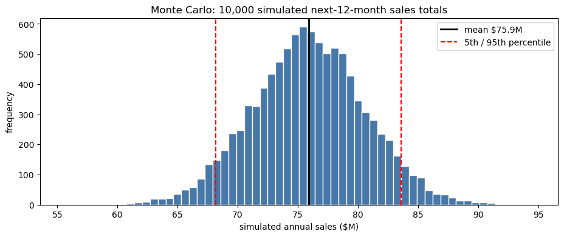
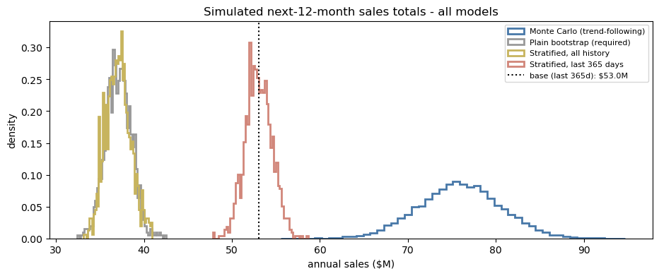
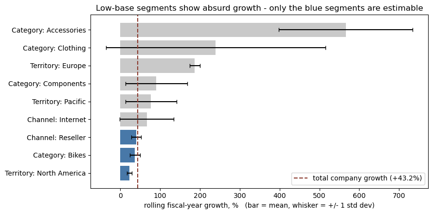
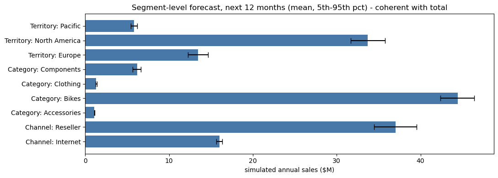

# 概率化销售预测 —— 蒙特卡洛与 Bootstrap 模拟

*[English version](README.en.md)*

> 用完整的结果分布替代单点销售预测，让企业针对**风险**做规划，而不是针对一个数字。

基于 AdventureWorks 三年交易历史（121,253 行订单明细，销售额 1.098 亿美元）构建，本项目将 12 个月销售预测输出为概率分布，量化管理层目标的达成概率，并产出与总量精确一致的渠道 / 品类 / 区域分项预测。

**交付物：**[📄 执行报告（PDF）](report/Executive_Report.pdf) · [📓 分析代码（Notebook）](notebooks/sales_forecasting_simulation.ipynb) · [**⬇️ 下载 Power BI 仪表板**](https://github.com/siiucd1-cyber/adventureworks-sales-forecasting/raw/main/dashboard/powerbi_dashboard.pbix)

---

## 核心结果

| | 预测值 | 90% 置信区间 |
|---|---|---|
| **趋势延续**（蒙特卡洛） | **$75.9M** | $68.2M – $83.6M |
| **增长停滞**（分层 Bootstrap） | **$53.0M** | $50.5M – $55.5M |

**真正让管理层重视的数字**：达成"超去年 10%"目标的概率，在趋势延续下约为 100%，但在增长停滞下只有 **12%**。这个落差——而不是任何一个点估计——才是企业真实的规划风险。

**以区间而非单一数字交付的建议：**

| 情景 | 数值 | 用途 |
|---|---|---|
| 主规划区间 | **$68M – $76M** | 从预算下限到趋势期望值 |
| 下行压力情形 | $53M | 现金流与库存压力测试 |
| 上行产能情形 | $84M | 供应链按此备产，但不据此做预算 |



---

## 面对的问题

AdventureWorks 长期依赖单点预测做年度规划。管理层需要回答两个点估计无法回答的问题：未来销售的**完整可能区间**是多少？达成特定财务目标的**概率**有多大？

## 分析方法

两类相互独立的模拟方法，外加三项方法论扩展。

**1 · 蒙特卡洛（自上而下）** —— 直接模拟年增长率这一驱动目标的核心不确定量，10,000 次试验，应用于当前运行水平。

**2 · Bootstrap 重抽样（自下而上）** —— 非参数方法：对真实日销售额有放回抽样，构建 1,000 个可能的未来年，不假设任何分布。

**3 · 三项扩展** —— 按月分层抽样（恢复季节性与当前销售水平）、同日联合抽样（层级一致的分项预测）、交易级泊松模拟（作为诊断性交叉验证）。

### 首先必须解决的方法论障碍

题目要求用完整日历年的同比增长率，但数据中只有 **2 个**完整年——字面执行只能得到**唯一 1 个**增长观测值（+40.6%），无法估计标准差。我评估了三种替代口径后才确定方案：

| 方案 | 定义 | 观测数 | 均值 | 标准差 | 结论 |
|---|---|---|---|---|---|
| A | 月度同比 | 23 | 80.6% | 87.1% | ✗ 月度尺度噪音；低基数月份严重抬高均值 |
| B | 财年同比 | 2 | 47.5% | 6.7% | ~ 度量对象正确，但 σ 随 15 天缺失数据的补算方式在 6.7%→11.8% 间摆动 |
| C | **滚动财年（TTM）同比** | **12** | **43.2%** | **8.8%** | ✓ **选用** —— 年度尺度的正确度量 + 足够观测数 |

方案 C 本质是把方案 B 的财年逻辑沿十二个月末滚动展开。其局限也在报告中如实声明：滚动窗口相互重叠导致观测正相关，σ 可能被低估——因此对波动率假设做了单独的压力测试。

**数据验证还识别出另一个陷阱**：日期维度表延伸至 2021 年 6 月，但交易在 2020 年 6 月 15 日戛然而止。对比最后 20 天（日均 $210,541）与此前 90 天（日均 $151,247）可见活动仍在**上升**——这是数据提取截断，而非业务萎缩。若误判为需求下滑，所有预测都会系统性偏低。

---

## 核心发现：粒度光谱效应

同一份数据在三种粒度上重抽样，得到三个差异巨大的风险估计：

| 重抽样粒度 | 模型 | 90% 区间宽度 |
|---|---|---|
| 年 | 蒙特卡洛 | **$15.4M** |
| 日 | 分层 Bootstrap | $5.0M |
| 交易 | 泊松模拟 | $1.5M |



粒度每细化一级，就多引入一层独立性假设——日与日独立、订单行与订单行独立——每多一个假设，模拟出的区间就进一步低于真实风险。**交易级模型看起来最精密，实际上对年度结果最过度自信。**

**由此提炼出的实用原则**：定目标用年粒度，排运营节奏用日粒度，看结构下钻用交易粒度。按问题选粒度，而不是按数据允许的最细粒度。

---

## 无需估计相关系数矩阵的层级一致预测

分项预测是自然的下一步需求，但在这份数据上分段独立模拟并不安全。诊断显示大多数分段在统计上不可估（Accessories 呈现 +566% 的"增长"纯粹源于低基数），且两个销售渠道的增长率相关系数为 **−0.72**——独立模拟会错报总量风险。



修复只需一个设计改动：将抽样对象从"日数值"改为"**日索引**"，被抽中的日期携带其完整分段分解。日内的跨段结构被精确保留，无需估计任何相关系数，且渠道/品类/区域分项在**全部 1,000 次试验中**都精确加总为模拟总量——notebook 中以断言验证。



由此产出的业务洞察：Bikes 占收入 **84%**（品类集中度风险）；Europe 占最近一年销售 **25%**，高于三年平均份额 18%（增长引擎）。Internet 渠道区间窄而 Reseller 区间宽——B2C 需求平稳 vs B2B 批量订单起伏大，两个渠道需要不同的规划缓冲。

---

## 结果验证

- **三方交叉验证**：分层日度 Bootstrap（$53.00M）、同日联合抽样（$53.04M）、交易级模拟（$53.14M）—— 三套独立编码的重抽样方案在同一抽样池上收敛，偏差 **0.3% 以内**。
- **敏感性分析**：在五组假设下重跑（不同增长率口径、σ×1.5、零增长压力、字面题意基数），量化出若使用过时的 2019 日历年基数而非当前运行水平，中心预测将被低估 **$14.6M**。
- **可复现性**：全程固定随机种子，报告中每个数字与图表重跑均可精确复现。

---

## 局限性

如实列出，因为它们界定了结果的适用边界：

1. **统计基础薄弱** —— 增长分布建立在 12 个**相互重叠**的滚动财年观测上，且全部来自单一三年扩张期。模型无法预见拐点，正态分布是启发式假设而非实证发现。
2. **Bootstrap 的可交换性假设** —— 假设同层内日期可互换，不保留周与周之间的动量；零增长抽样池将分段构成冻结在最近 12 个月。
3. **粒度越细越低估风险** —— 交易级重抽样拆散了现实中同日到达的多行 B2B 订单，抹除日内聚集效应，其 $1.5M 的区间不构成可信的年度风险范围。
4. **数据边界** —— 仅三年历史且被提取截断；多数分段因体量小或基数低而无法可靠估计增长率。
5. **未纳入外部驱动** —— 模型完全基于内生历史数据，宏观经济、竞争格局与定价策略均在模型之外。

**后续改进**：按季度滚动重跑。每新增一个季度即增加滚动财年观测、收紧增长分布；待历史积累充分后，带相关性抽样的分段蒙特卡洛将变得可行。

---

## 仪表板

配套的 Power BI 仪表板共 6 页，用于向管理层做汇报：

| 页面 | 内容 |
|---|---|
| 01 History | 历史月度销售，按 Internet / Reseller 双渠道堆积 |
| 02 Risk Range | 蒙特卡洛结果直方图 + 三张 KPI 卡（预算下限 / 期望值 / 上行产能），两端 5% 尾部条形以警示色区分 |
| 03 Model Comparison | 四个模型的年度总额分布叠加对比 |
| 04 Operations | 365 天预测带（P5 / 中位数 / P95）+ 分财季中位数柱状图 |
| 05 Segment | 分段预测条形图 + 维度切片器（渠道 / 品类 / 区域一键切换） |
| 06 Recommendation | 四档情景 KPI 卡与最终建议 |

### ⬇️ [点此下载仪表板文件（powerbi_dashboard.pbix，390 KB）](https://github.com/siiucd1-cyber/adventureworks-sales-forecasting/raw/main/dashboard/powerbi_dashboard.pbix)

下载后用 **Power BI Desktop**（Windows 免费软件）打开即可查看全部 6 页与交互功能。

> 说明：`.pbix` 是二进制格式，GitHub 无法在线预览——直接点仓库里的文件只会看到一个空白页面，这是正常现象，请使用上方下载链接。本仓库 `figures/` 目录下的图表由 notebook 生成，内容与仪表板一致，无需下载即可在线查看。

---

## 仓库导航

```
notebooks/   sales_forecasting_simulation.ipynb   完整分析，已保存输出（GitHub 可直接渲染）
report/      Executive_Report.pdf                 14 页执行报告，9 图 8 表
dashboard/   powerbi_dashboard.pbix               6 页交互式仪表板
             pitch_data_for_powerbi.xlsx          为 BI 作图准备的模拟结果
figures/     *.png                                全部图表，从 notebook 导出
data/        AdventureWorks_Sales.xlsx            微软官方样例数据集（星型模型）
```

### 复现方式

```bash
pip install -r requirements.txt
jupyter notebook notebooks/sales_forecasting_simulation.ipynb   # Kernel → Restart & Run All
```

端到端运行时间不到一分钟。随机种子已固定，输出与报告完全一致。

**技术栈**：Python（pandas、NumPy、Matplotlib）· Jupyter · Power BI（DAX 度量值、条件格式、分箱）· 维度建模 / 星型模型

---

## 说明

数据为微软 AdventureWorks 官方样例数据集，仅用于方法演示，相关数字不代表真实行业基准。本项目为都柏林大学（UCD）Financial Data Technology 课程的学术项目。AI 工具用于协助代码实现与文档排版；建模框架、分析决策与结论由本人确定。
